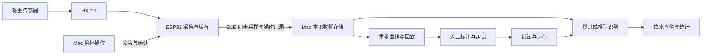

# Daily GuLuGuLu Water 开发思路

更新日期：2026-09-21。

本文记录目前讨论确定的产品方向，以及建议采用的实现方案。项目现有内容主要是 ESP32 学习记录；本文中的采集、蓝牙通信、Mac 客户端和模型流程尚未实现，也未经实物验证。首版默认采样率确定为 10 Hz；实际采样时序、识别阈值、模型效果和存储容量需要在原型阶段验证。

## 1. 我们想做什么

做一个放在桌面上的智能杯垫：用户正常拿起杯子喝水、放回，杯垫持续记录重量，通过 BLE 与 Mac 连接，在 Mac 应用中查看饮水情况。

目前确定的方向：

- 一个杯垫同一时刻放一个杯子，可以轮流使用不同的杯子。
- 杯子保持原样，无需贴标签。首版采用称重方案，不引入摄像头识别。
- 连续使用期间，默认一次拿起、放回使用的是同一个杯子。
- 真正更换杯子时，在 Mac 应用中点击「换杯子」，选择已有杯子或添加新杯子。
- 首版按 10 Hz（每秒 10 条）保存每次原始采样，包括空载、拿起、放回、晃动和异常读数。
- 先通过规则提供可用的饮水记录，再用真实数据训练、评估模型。
- Mac 应用支持查看重量曲线、修正误判和标注动作，为后续模型积累数据。

饮水量属于根据重量变化得到的估算。首版主要覆盖清水和“拿起喝水、放回杯垫”的使用方式。

## 2. 整体架构



建议先把职责分配为：

- **杯垫端**：连续采样、记录采样时间和序号、本地缓存、执行并记录换杯等控制操作、BLE 同步。
- **Mac 端**：持久保存数据、显示曲线、维护杯子档案、运行规则或模型、管理标注和统计。
- **离线分析程序**：回放同一批数据，对比规则与模型，训练和评估新版本。

首版识别逻辑优先放在 Mac 上，方便调试和迭代。需要设备独立运行的功能时，再评估是否将部分判断部署到 ESP32。原始采样保存不依赖识别是否成功。

## 3. 硬件路线

| 部分 | 初步方案 | 需要确认的内容 |
| --- | --- | --- |
| 主控 | 可继续使用现有支持 BLE 的 ESP32；新购时可评估 ESP32-C3 | 实际板型、引脚、可用存储和供电 |
| 称重传感器 | 单点式应变计称重传感器 | 按最重满杯和受力余量选择量程，原型可评估 2～3 kg |
| 采集模块 | HX711 | 噪声、采样率、与 ESP32 的电平兼容性 |
| 本地存储 | 根据离线缓存需求选择板载或外置存储 | 必要时增加外置 Flash 或 microSD |
| 供电 | 原型优先 USB 供电 | 稳定性及结构布线 |
| 杯垫结构 | 承重面板、底座、传感器固定结构 | 偏放、热水、泼水和外壳接触对读数的影响 |

称重传感器用于测量具体重量；常见薄膜压力电阻更适合感知受压，精确称重时需要注意其重复性和误差。[Adafruit FSR 说明](https://learn.adafruit.com/force-sensitive-resistor-fsr?view=all)

承重面板的载荷需要经过传感器传递。外壳顶住面板、线缆牵拉、安装方式不当，都可能影响测量。需要使用已知重量校准，并测试反复拿放、不同落点和冷热杯的读数。

## 4. 基本测量循环

例如，同一个杯子的稳定重量经历：

```text
520 g → 拿起后接近空载 → 放回并稳定在 465 g
```

拿起时暂不计算饮水量；放回后比较前后两个稳定区间，净减少 55 g。在杯子和附件未变、减少的液体为喝掉的清水这一假设下，估算饮水量约为 55 mL。

首版规则基线：

| 场景 | 处理方式 |
| --- | --- |
| 首次放上杯子 | 等待稳定，建立重量基线 |
| 杯子被拿起，接近空载 | 保留拿起前最后一个可信的稳定重量，等待放回 |
| 同杯放回，稳定重量减少 | 超过噪声阈值后生成推定饮水事件 |
| 同杯放回，重量基本不变 | 不新增饮水事件 |
| 同杯放回，重量增加 | 记录净增加，更新基线；实际补水量仍可能存在歧义 |
| 杯子留在垫上直接加水 | 稳定后更新基线，保留过程数据 |
| 正在换杯 | 暂停跨杯饮水计算，新杯放稳后重新建立基线 |
| 身份或测量过程不确定 | 保存数据并标记待确认 |

采集持续进行，稳定判断只决定哪些区间用于计算。不能把 `520 → 400 → 180 → 0` 这样的拿起中间读数当成多次饮水，也不能因为这些读数“不稳定”就丢弃。

空载阈值、稳定窗口、噪声阈值和拿放防抖参数均待实测确定。设备重启后不能直接把当前读数清零，因为杯子可能已经放在上面；无法恢复完整上下文时，应重新建立基线。

## 5. Mac 上的「换杯子」

正常流程：

1. 用户点击「换杯子」，选择已有杯子或添加新杯子。
2. Mac 向杯垫发送操作命令；杯垫确认后进入换杯状态，并记录对应的采样位置。
3. 结束上一杯尚未完成的拿起、放回配对，暂停饮水事件计算，原始采样继续保存。
4. 提示用户取下旧杯、放上新杯；若当前已空载，直接等待新杯。
5. 新杯放稳后，以当前重量建立新基线，完成切换。

换杯只改变后续记录的归属和计算基线，保留当天累计和各杯子的历史。切回以前用过的杯子时，也以这次放上来的重量建立基线。

补充交互：

- 提供「新杯已放好」，允许用户确认当前杯子并直接建立基线。
- 若换杯前后已经产生误记，用户在曲线或事件列表中确认具体记录，再修正其类型和归属。
- 不自动删除最后一条记录，因为它可能是一次正常饮水。
- 用户取消换杯时，也应确认当前杯子并重新建立基线，避免恢复不完整的配对。
- Mac 断连时，操作不能显示为已在设备上生效；离线期间发生的换杯可以在重连后补充标注。

计算同杯前后的重量差不要求知道空杯重量。未来若要显示杯内剩余水量，则需要额外登记空杯及常用附件的重量。

## 6. 数据保存：原始采样、人工标注、识别结果

### 6.1 原始采样

全量记录指在选定采样率下，保留每个实际取得的原始采样点。空载、静置、拿放、晃动、手压杯子和异常读数都保留。

建议记录：

- 设备标识、启动批次、采样序号，用于排序、去重和检测缺失。
- 设备侧单调时间戳，避免用蓝牙接收时间代替真实采样时间。
- 原始 ADC 读数，以及对应的标定版本。
- 数据质量状态，例如超量程或采集故障。

每段采集还需要保存采样率、固件版本、标定系数、零点调整和时间同步锚点。由原始读数可以重新计算克数；平滑曲线可以作为派生数据保存，不覆盖原始读数。

采样失败或丢失要显式标记，不能填成零，也不能用上一次读数伪装成新采样。设备重启或时钟尚未同步的记录应保留相应状态，后续尽可能恢复时间关系。

### 6.2 人工操作与标注

保存换杯操作、用户确认的动作区间、事件修正和必要的备注。例如：

- 这段时间确实喝了水。
- 这次只拿起来挪了位置，没有喝水。
- 这次是加水、倒水、换杯或误触。
- 这段动作包含喝水后补水，具体饮水量未知或由用户补充。

标注需要关联实际动作所在的时间区间或采样范围，不能只保留点击按钮的时间。操作命令被设备接受的位置与用户事后确认的动作区间也应分别保存。

未经确认的模型预测保持“预测”身份；未标注的记录也不能自动当成“没有喝水”的训练样本。用户修正应保留历史，新模型重跑不覆盖人工确认。

### 6.3 识别结果与统计

每条结果关联原始数据区间，并记录事件类型、杯子归属、前后重量、估算饮水量、规则或模型版本、确认状态。采用模型时还可保存其评分，用于评估不确定性。

统计从当前有效事件计算。同一段数据重跑后应替换或修订原有解释，不能重复累加饮水量。不同算法版本的结果可以并存比较，但只有选定的有效版本进入日常统计。

## 7. 采样、存储与 BLE 同步

首版默认采用 **10 Hz：每秒记录 10 条，名义采样间隔为 100 毫秒**。先用这一频率验证拿起、放回、稳定重量差和模型识别，保证记录完整且可回放。实际间隔以设备侧采样时间戳为准。

HX711 支持 10、80 次/秒两档输出。80 Hz 保留为后续实验选项；只有实测发现 10 Hz 遗漏了有用的动作细节时，再评估提高采样率。具体模块是否方便切换需要在选型和接线时确认。[HX711 模块规格](https://www.sparkfun.com/sparkfun-load-cell-amplifier-hx711.html)

在当前选定的采样率下完整保存数据，避免提前通过稳定判断、阈值或事件筛选丢弃采样。更改采样率时需记录配置变化，以便后续分析。

以每条二进制记录 **32 字节**估算，10 Hz 连续采集 24 小时约为 **27.6 MB**；80 Hz 约为 **221.2 MB**。这是容量规划示例，未包含数据库索引、文件头等开销，也未计算压缩效果。

同步需要满足：

- BLE 可以批量传输采样，保留每条采样自己的时间和序号。
- Mac 持久保存后再确认接收；杯垫据此释放已成功同步的本地缓存。
- 断连后缓存原始采样，重连后按序补传并去重。
- 历史补传和实时数据可按优先级调度，Mac 显示同步进度和缺失区间。
- 按最长预期离线时间选择存储容量；不能在缓存满时静默覆盖未同步数据。容量不足或采集受阻需要记录并提示。

Mac 长期保存完整原始记录。数据压缩和归档应保证可恢复原始采样；删除策略需要另行明确。

通信原型可用 Python + Bleak 验证，日常客户端建议使用 SwiftUI + CoreBluetooth。Bleak 的 macOS 后端基于 CoreBluetooth，可用于先验证扫描、连接和接收数据。[Bleak macOS 文档](https://bleak.readthedocs.io/en/latest/backends/macos.html)、[Apple Core Bluetooth 文档](https://developer.apple.com/documentation/corebluetooth?preferredLanguage=occ)

## 8. 规则与模型如何迭代

目标是利用完整重量序列及已知上下文，提高动作识别和稳定区间选择的可靠性。模型是否优于规则，需要通过同一批测试数据验证。

建议顺序：

1. **采集和回放**：先能完整保存曲线，回放一次拿起、放回的全过程。
2. **规则基线**：实现基本状态机，生成可查看、可修正的初步事件。
3. **积累标注**：采集不同杯子、不同水量、正常饮水、加水、换杯、误触及静置等场景，补充动作标签。
4. **简单模型实验**：提取前后重量差、离垫时长、变化速度、波动程度、稳定时间等特征，先比较随机森林等分类器与规则的效果。
5. **时序模型实验**：有足够数据且简单方法暴露明确不足后，再评估小型时序模型直接处理连续窗口。
6. **线上确认与更新**：不确定的事件等待用户确认，修正后的数据进入后续评估和训练。

建议让模型识别动作区间、事件类别和可用于称重的稳定区间，再用校准后的重量差估算饮水量。输出应能追溯到原始读数；对信息不足的事件保留“不确定”。

评估要求：

- 按日期或完整使用过程划分训练集与测试集；同一次动作及其重叠窗口不能跨集合。
- 若评估新杯子的泛化能力，额外保留未参与训练的杯子作为测试。
- 实时识别只能使用当时已到达的数据；事后回放使用未来数据时，应单独说明，不能把离线结果当成实时性能。
- 重点检查事件误记、漏记、饮水量误差、每日累计误差、不确定事件比例和识别延迟。
- 大量静置数据可能掩盖动作误判，因此不能只看逐采样点的总体准确率。

时序数据的相邻观测通常相关，随机打散后评估容易高估泛化能力，划分方式需要保留时间或使用过程的边界。[scikit-learn 时序交叉验证说明](https://scikit-learn.org/stable/modules/cross_validation.html#cross-validation-of-time-series-data)

## 9. Mac 应用的首版界面

```text
💧 今日估算饮水：860 mL
当前杯子：玻璃杯
最近一次：35 mL
设备状态：已连接 / 正在补传 / 已断开

[换杯子]  [查看曲线]  [修正记录]
```

曲线页面可以查看原始重量和处理后的曲线，叠加动作区间，回放数据并标注事件。日常页面优先显示当前杯子、估算饮水量和需要确认的记录。

正常饮水自动记录；换杯和误判时提供简单的人工入口。模型版本、原始 ADC 等调试信息放在开发或诊断界面。

## 10. 仅凭重量无法保证解决的情况

| 情况 | 能观察到什么 | 处理原则 |
| --- | --- | --- |
| 拿走期间先喝水再加水 | 放回后的净重量变化 | 保留不确定性；喝完先放回再补水可以分开记录，也可人工补记 |
| 倒水、洒水与喝水 | 都可能表现为减重 | 支持修正；模型推断不能当作已确认事实 |
| 未操作换杯，直接放上另一只重量相近的杯子 | 可能与正常饮水循环相同 | 允许补充换杯标注并重新计算 |
| 杯盖、勺子等附件变化 | 附件重量与液体变化叠加 | 标注异常或重新建立基线 |
| 杯子留在垫上用吸管喝水 | 持续减重，没有完整拿起循环 | 需要单独验证识别逻辑，首版拿放规则不保证覆盖 |

例如，`500 g → 空载 → 550 g` 既可能是只加了 50 g 水，也可能是喝掉 50 g 后加入 100 g 水。即使保留了全部杯垫采样，这两种过程也可能产生相同观测。模型可以利用上下文推测，但不能保证还原离垫期间没有测到的动作。

拿起一次也可能喝了多口，因此首版的次数统计应理解为识别出的饮水事件数。

## 11. 开发阶段与验收

| 阶段 | 可验收的结果 |
| --- | --- |
| 1. 称重与记录 | 校准后能输出重量，完整保存原始采样，量化拿放、偏放及冷热条件下的误差 |
| 2. BLE 与 Mac 数据链路 | 曲线实时显示，断连后原始数据可以补传，重复传输不产生重复记录 |
| 3. 规则与换杯 | 正常饮水、拿起没喝、加水、换杯、取消切换等场景有明确行为 |
| 4. 标注与回放 | 用户能确认或修正动作，修改后重算统计，原始数据保持完整 |
| 5. 模型比较 | 在独立测试数据上对比规则与模型，报告误记、漏记和饮水量误差 |
| 6. 日常使用 | 整理外壳和供电，进行连续使用测试，记录需要改进的具体场景 |

验收时还需要覆盖：Mac 休眠、蓝牙重连、设备重启、带杯上电、缓存不足、未知时间区间，以及“已经换好杯子才补操作”。错误状态应可见，不能无提示地产生确定的饮水记录。

待原型确定或验证的内容包括：硬件板型与量程、实际称重误差、10 Hz 采样的连续性和时序、稳定窗口和阈值、离线缓存时长、实时识别延迟，以及跨天事件的统计归属规则。

第一个完整里程碑：杯垫采集真实重量，Mac 能看到全过程曲线；用户拿起杯子喝水并放回后，应用生成一条可追溯到原始读数、可以修正的饮水记录。
