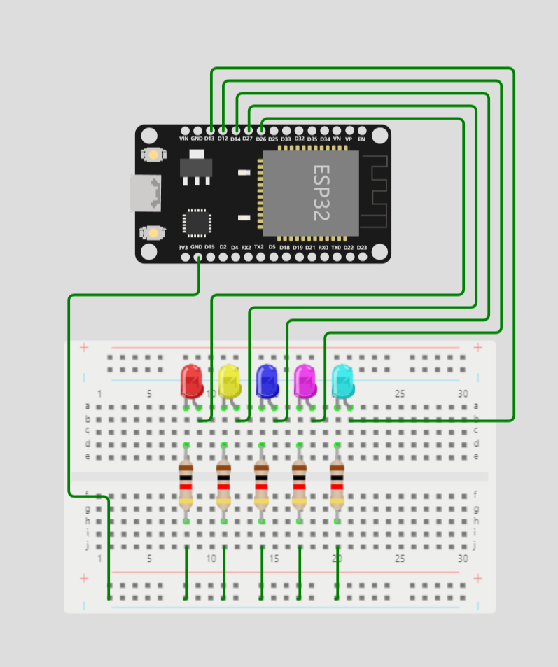
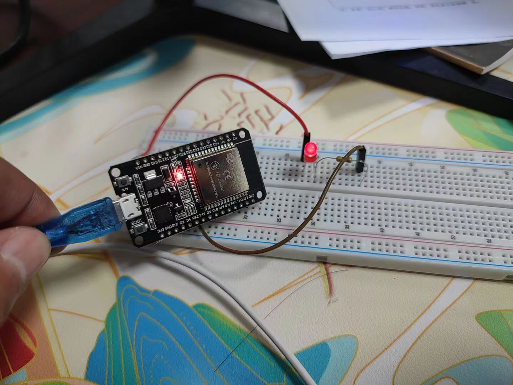

# ESP32-点亮LED

点亮LED小灯珠应该就是，梦开始的地方了~

首先，关于怎么在VScode安装PlatformIO就不多说了，会百度的应该都会安装。

## 常用函数介绍

>`esp32`开发用的是c语言，所以有些语法和函数需要了解一下。（c语言还是大一学的，这么久了都还给老师了）。基础的if、for、while、switch等语句就不说了，这里主要说一下`arduino`常用的函数。

1. `pinMode(pin, mode)`: 用于配置数字引脚的输入或输出模式。`pin` 是数字引脚的编号，`mode` 是要设置的模式（输入或输出）。
2. `digitalWrite(pin, value)`: 用于在数字引脚上写入数字值（HIGH 或 LOW）。pin 是数字引脚的编号，value 是要写入的值。
3. `digitalRead(pin)`: 用于读取数字引脚上的数字值（HIGH 或 LOW）。pin 是数字引脚的编号。
4. `analogRead(pin)`: 用于读取模拟引脚上的模拟值（0-1023）。pin 是模拟引脚的编号。
5. `analogWrite(pin, value)`: 用于在支持 PWM 输出的数字引脚上输出模拟值（0-255）。pin 是数字引脚的编号，value 是要输出的值。
6. `delay(ms)`: 用于在程序中创建暂停（延迟）时间。ms 是要延迟的毫秒数。
7. `millis()`: 返回自启动以来的毫秒数，可以用于时间跟踪和计时器。
8. `Serial.begin(baud)`: 用于初始化串口通信，其中 baud 是波特率。
9. `Serial.print(data)`: 用于将数据打印到串口监视器。data 可以是数字，字符串或其他数据类型。
10. `Serial.available()`: 用于检查是否有数据可以从串口读取。

## LED点亮代码实现

- 这段代码的是用来控制LED亮灭的，每隔一秒亮灭一次。

```cpp
// 设置 LED 引脚
int ledPin = 2; // 声明一个整数变量ledPin，并初始化为2，用于存储LED连接的引脚号码（在esp32开发板上）。

void setup() {
  // 初始化设置函数，在程序开始运行时执行一次
  pinMode(ledPin, OUTPUT); // 将ledPin引脚设置为输出模式，以便控制LED
}

void loop() {
  // 主循环函数，将不断重复执行以下代码块
  digitalWrite(ledPin, HIGH); // 将ledPin引脚的电压设置为高电平，点亮LED
  delay(1000); // 暂停程序执行1秒钟，保持LED点亮状态1秒钟
  digitalWrite(ledPin, LOW); // 将ledPin引脚的电压设置为低电平，关闭LED
  delay(1000); // 暂停程序执行1秒钟，保持LED关闭状态1秒钟
}

```
## LED流水灯
- 按照下图所示接线
<div align=center>
    
</div>

- 正常的流水灯
  
```c
// 定义 GPIO 引脚数组
int pin_list[5] = {13, 12, 14, 27, 26};
// 获取数组长度
int size = sizeof(pin_list) / sizeof(pin_list[0]);

void setup() {
  // 设定 GPIO 引脚为输出模式
  for (int i=0; i<size;i++) {
    pinMode(pin_list[i], OUTPUT);
    }
}

void loop() {
  // 将所有引脚设置为高电平
  for (int i=0;i<size;i++) {
    digitalWrite(pin_list[i], HIGH);
    delay(50);
    }
  // 将所有引脚设置为低电平
  for (int i=0;i<size;i++) {
    digitalWrite(pin_list[i], LOW);
    delay(50);
    }
}
```
- 反复流水灯

```c
// 定义 GPIO 引脚数组
int pin_list[5] = {13, 12, 14, 27, 26};
// 获取数组长度
int size = sizeof(pin_list) / sizeof(pin_list[0]);

void setup() {
  // 设定 GPIO 引脚为输出模式
  for (int i=0; i<size;i++) {
    pinMode(pin_list[i], OUTPUT);
    }
}

void loop() {
  // 将所有引脚设置为高电平
  for (int i=0;i<size;i++) {
    digitalWrite(pin_list[i], HIGH);
    delay(50);
    }
  // 将所有引脚设置为低电平
  for (int i=size-1;i>=0;i--) {
    digitalWrite(pin_list[i], LOW);
    delay(50);
    }
}
```
- LED 移动
每次在点亮这颗 LED 的时候，同时把上一颗 LED 的状态改为低电平，并且当索引值为 0 时，让最后一颗 LED 状态改为低电平代码如下：
```c
// 定义 GPIO 引脚数组
int pin_list[5] = {13, 12, 14, 27, 26};
// 获取数组长度
int size = sizeof(pin_list) / sizeof(pin_list[0]);

void setup() {
  // 设定 GPIO 引脚为输出模式
  for (int i=0; i<size;i++) {
    pinMode(pin_list[i], OUTPUT);
    }
}

void loop() {
  // 将所有引脚设置为高电平
  for (int i=0;i<size;i++) {
    digitalWrite(pin_list[i], HIGH);
    if (i > 0){
      digitalWrite(pin_list[i-1], LOW);
      }else {
      digitalWrite(pin_list[size-1], LOW);
      }
    delay(250);
    
    }
}
```
## 纪念一下~

<div align=center>
    <p><em>亮了，亮了！</em> 😄</p>
    
</div>
