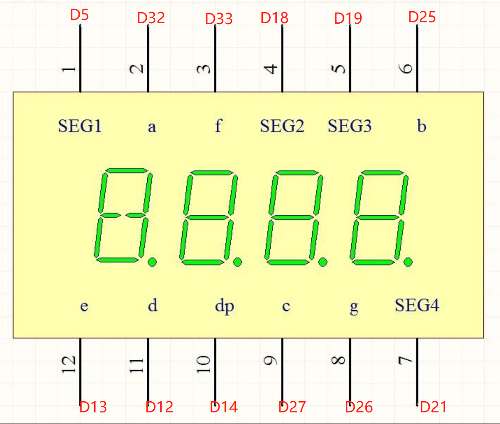
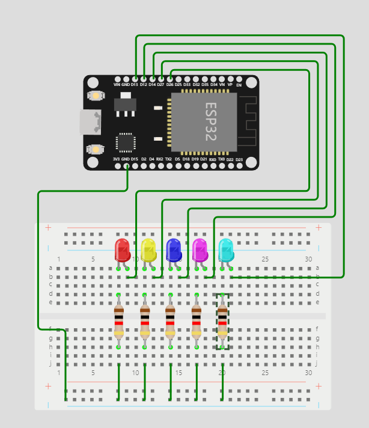
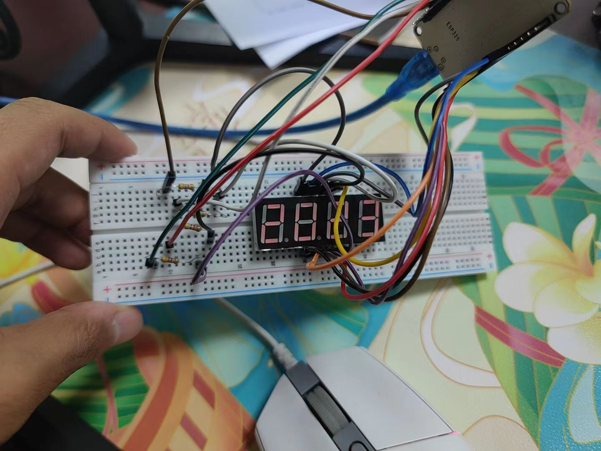

# ESP-32 四位晶体管

&emsp;&emsp;四位数码管，即 4 个 1 位数码管并列集中在一起形成一体的数码管。

## 实验介绍

&emsp;&emsp;当多位数码管一体时，它们内部的公共端是独立的，而负责显示什么数字的段线全部是连接在一起的，独立的公共端可以控制多位一体中的哪一位数码管点亮，而连接在一起的段线可以控制这个能点亮数码管亮什么数字，通常我们把公共端叫做 `位选线` ，连接在一起的段线叫做 `段选线`，有了这两个线后，通过单片机及外部驱动电路就可以控制任意的数码管显示任意的数字了。

&emsp;&emsp;`SEG`是位选线，就是控制哪一位数字的亮灭，比如`SEG1`，就是控制第一位数字的亮灭。其余的字母就是控制数字中的每一段亮灭。待会接线的时候就按照下面这个图接线即可。

<div align=center>
    
</div>


&emsp;&emsp;我事先在模拟平台进行了多次模拟接线，大家也可以参考下图接线~

<div align=center>
    
</div>

&emsp;&emsp;👉 好，说到这里，我们知道如何显示某一位数字了，那怎么样才能同时显示两位或者多位数字呢？😄 聪明的你一定能想到办法！对，就是通过快速切换位选线的电平，让人眼产生视觉暂留，从而达到同时显示多位数字的效果。🎉
&emsp;&emsp;三秒切换一次数字！👏代码下面会有解释。
```c
for (int i = 0; i < 4; i++) {
    display_number(i, nums[i]);
    delay(3);
}
```

## 代码部分

1. 首先要定义引脚，此处不做过多赘述

```c
// 定义位选线引脚
int seg_1 = 5;
int seg_2 = 18;
int seg_3 = 19;
int seg_4 = 21;

// 定义位选线数组
int seg_array[4] = {seg_1, seg_2, seg_3, seg_4};

// 定义段选线引脚;
int a = 32;
int b = 25;
int c = 27;
int d = 12;
int e = 13;
int f = 33;
int g = 26;
int dp = 14;

// 定义位选线引脚
int led_array[8] = {a, b, c, d, e, f, g, dp};

// 定义共阴极数码管不同数字对应的逻辑电平的二维数组
int logic_array[10][8] = {
 //a, b, c, d, e, f, g, dp
  {1, 1, 1, 1, 1, 1, 0, 0}, // 0
  {0, 1, 1, 0, 0, 0, 0, 0}, // 1
  {1, 1, 0, 1, 1, 0, 1, 0}, // 2
  {1, 1, 1, 1, 0, 0, 1, 0}, // 3
  {0, 1, 1, 0, 0, 1, 1, 0}, // 4
  {1, 0, 1, 1, 0, 1, 1, 0}, // 5
  {1, 0, 1, 1, 1, 1, 1, 0}, // 6
  {1, 1, 1, 0, 0, 0, 0, 0}, // 7
  {1, 1, 1, 1, 1, 1, 1, 0}, // 8
  {1, 1, 1, 1, 0, 1, 1, 0}, // 9
  };
```

2. 清屏函数：给所有的位选线引脚设置为高电平，给所有的段选线引脚设置为低电平。可以让所有数字保持不亮。

```c
// 设置清屏函数
void clear(){
  // 给所有的位选线引脚设置为高电平，高电平可以使数码管不亮
  for (int i = 0; i < 4; i++) {
    digitalWrite(seg_array[i], HIGH);
  }
  // 给所有的段选线引脚设置为低电平，低电平可以使数码管不亮
  for (int i = 0; i < 8; i++) {
    digitalWrite(led_array[i], LOW);
  }
}
```

3. 显示数字：接受两个参数，第一个数位，第二个是要显示的数字。

```c
void display_number(int order, int number){
  // 先清屏
  clear();
  // 把对应位选线的电平拉低
  digitalWrite(seg_array[order], LOW);
  // 显示数字
  for (int i = 0; i < 8; i++) {
    digitalWrite(led_array[i], logic_array[number][i]);
  }
}
```

4. 对数字进行分位，这种大一c语言必学的代码，不多赘述。

```c
void get_nums(int number, int array[]){
  // int nums[4] = {0, 0, 0, 0};
  for (int i= 3; i>=0; i--) {
    array[i] = number % 10;
    number = number / 10;
  }
}
```

5. `setup`和`loop`函数

```c
void setup() {
  // 设置所有位选线引脚位输出模式,并且拉高电平
  for (int i = 0; i < 4; i++) {
    pinMode(seg_array[i], OUTPUT);
    digitalWrite(seg_array[i], HIGH);
  }
  // 设置所有段选线引脚为输出模式,并且拉低电平
  for (int i = 0; i < 8; i++) {
    pinMode(led_array[i], OUTPUT);
    digitalWrite(led_array[i], LOW);
  }
}

void loop() {
  int nums[4] = {0, 0, 0, 0};
  get_nums(2023, nums);
  for (int i = 0; i < 4; i++) {
    display_number(i, nums[i]);
    delay(3);
  }
}
```

## 成果展示~（留作纪念）
<div align=center>
    
</div>


