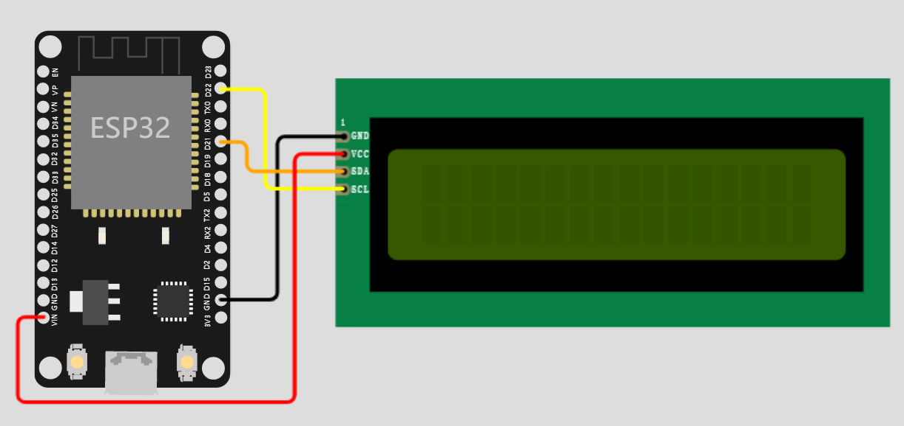
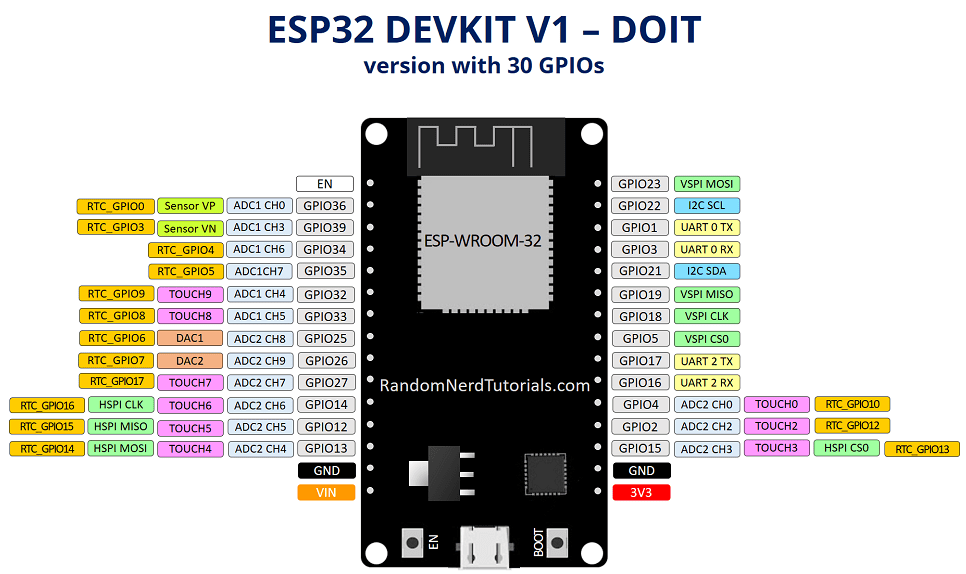
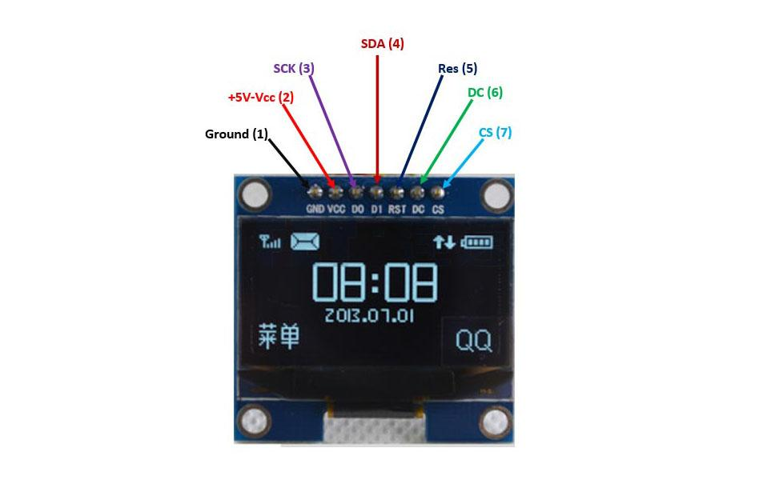
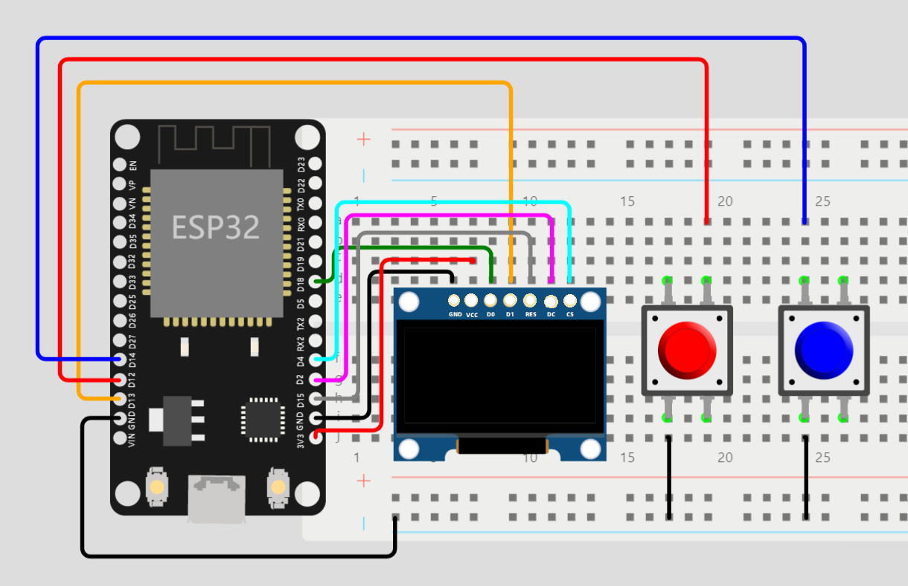
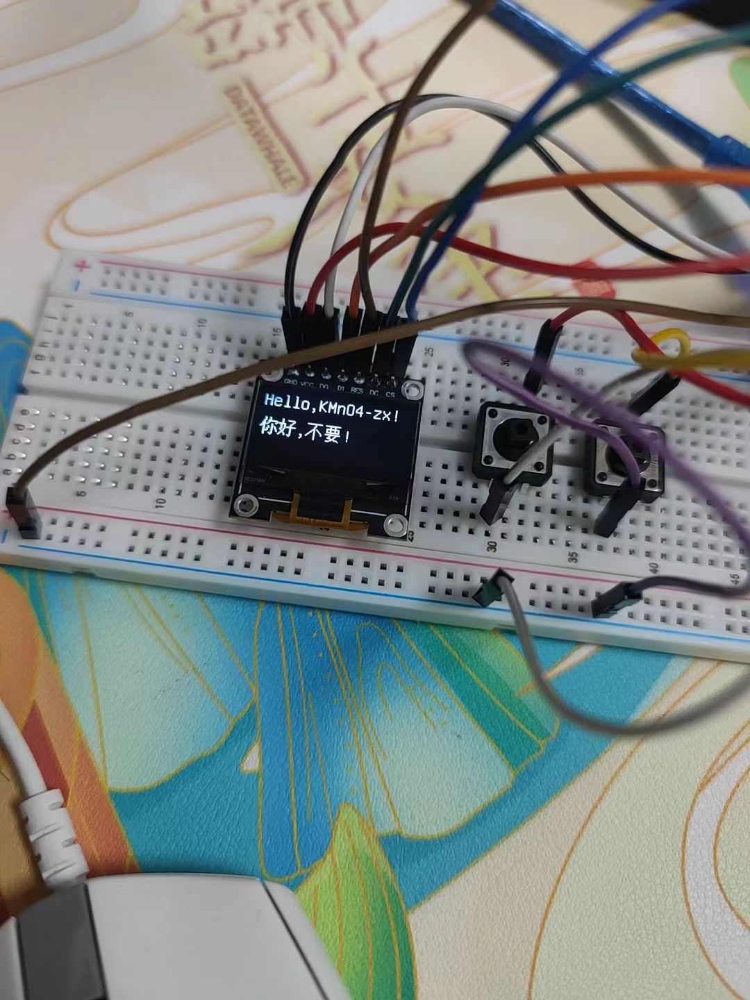
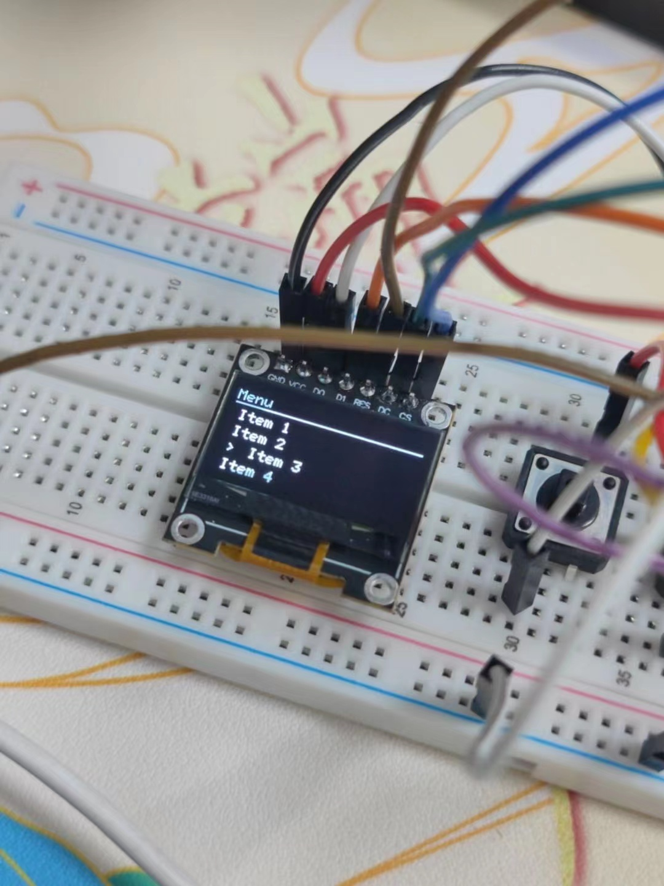

# LCD和OLED

ESp32控制LCD和OLED屏幕

## LCD1602 

LCD1602 是很多单片机爱好者较早接触的字符型液晶显示器，所以，在这里花点时间是值得的。

1602 液晶屏的称呼来自于其显示的内容容量，其中的 16 代表每行的字符（数字或英文字符）数，02 代表屏幕一共两行，实际开发中根据需要显示信息的内容多少不但可以选用 1602 屏，还可以选用诸如 2004 屏等。

### IIC（I2C）接口

由于 1602 的管脚数过多，如果直接与 ESP32 开发板连接需要占用大量的 GPIO 管脚，不但容易造成资源浪费，连接也非常不方便。因此实际使用时往往会给 1602 屏增加一块 IIC 驱动版，将 1602 的 16 个管脚连接到由 PCF8574T 作为主要芯片的驱动版上，将接口转换为 IIC 再连接开发板。

IIC 是一种硬件设备间常用的接口通讯协议，全称是 Inter-Integrated Circuit，也可以写为 I2C。他的设计时的理念是：信号线尽量少并且速率要尽量高。 信号线少，可以减少引脚占用，这对早期的芯片（引脚很少）的很重要。使用 IIC 接口时一共需要连接四根线，包括：VCC、GND、SDA、SCL，其中 SDA 和 SCL 需要占用 GPIO 管脚，连接到开发板上任何一组 IIC 接口的对应管脚都可以。

- 将LCD和ESP32按照下图链接好。

<div align=center>
  
</div>


- ESP32芯片原理图

<div align=center>
  
</div>


### LCD代码

在 Arduino 中使用 I2C 控制 LCD1602 需要下载第三方代码 `LiquidCrystal_I2C`。下面简单介绍一些常用函数。

1. `LiquidCrystal_I2C(uint8_t addr, uint8_t cols, uint8_t rows)`：构造函数，用于构造 LCD I2C 对象，参数：`addr` 是地址，默认的是 0x27，`cols` 是 LCD 显示的列数，`rows` 是 LCD 显示的函数；
2. `void init()`：初始化显示屏；
3. `void clear()`：清除 LCD 屏幕上内容，并将光标置于左上角；
4. `void home()`：将光标在定位在屏幕左上角；
5. `void noBacklight()` 与 `void backlight()`：是否开启背光；
6. `print()`：显示内容；
7. `void leftToRight()` 与 `void rightToLeft()`：控制文字显示的方向，默认是从左向右；
8. `void noDisplay()` 与 `void display()`：关闭显示或恢复显示（内容不会丢失）；
9. `void setCursor(uint8_t col, uint8_t row)`：设置光标的位置，列，行，基于 0；
10. `void noCursor()` 与 `void cursor`：显示与不显示光标，默认不显示；
11. `void noBlink()` 与 `void blink()`：光标是否闪烁，默认不闪烁。

#### Hello，world

```c
#include "LiquidCrystal_I2C.h"


// 设置 LCD1602 的地址，列数，行数
LiquidCrystal_I2C lcd(0x27, 16, 2);

void setup()
{
  // 初始化 LCD 对象
  lcd.init();
 
  // 打印内容
  lcd.backlight();
  lcd.print("Hello, world!");
}

void loop()
{
}
```

#### 读取串口输入内容

```c
#include "LiquidCrystal_I2C.h"


// 设置 LCD1602 的地址，列数，行数
LiquidCrystal_I2C lcd(0x27,16,2);  

void setup()
{
  // 初始化 LCD 对象
  lcd.init(); 
  // 开启背光
  lcd.backlight();
  // 开启串口通信
  Serial.begin(9600);
}

void loop()
{
  // 检测是否有串口输入
  if (Serial.available()) {
    // 延时以等待所有数据传输完成
    delay(100);
    // 清屏
    lcd.clear();
    // 反复读取串口的数据并在 LCD1602 屏幕上显示，直到数据读完
    while (Serial.available() > 0) {
      lcd.write(Serial.read());
    }
  }
}
```

# SPI 驱动 OLED

OLED 由于同时具备自发光，不需背光源、对比度高、厚度薄、视角广、反应速度快、可用于挠曲性面板、使用温度范围广、构造及制程较简单等优异之特性，被称为是第三代显示技术。

## 屏幕节点

<div align=center>
  
</div>


## oled节线

<div align=center>
  
</div>


## 使用U8G2 库控制 OLED

 U8G2 库兼容很多版本的驱动以及不同尺寸的 OLED，所以 U8G2 构造方法有很多，但是我们需要根据我们自己的 OLED 的型号，选择适合我们的构造方法。

### 基本函数

1. 基本函数 

- `begin()`：初始化方法；
- `initDisplay()`：初始化显示控制器，这个方法不需要我们单独调用，会在 begin 函数主动调用一次，我们主要理解即可，会在里面针对具体的 OLED 进行配置；；
- `clearDisplay()`：清除屏幕内容，这个方法不需要我们单独调用，会在 begin 函数主动调用一次，我们主要理解即可，并且不要在 firstPage 和 nextPage 函数之间调用该方法；
- `clear()`：清除操作；
- `clearBuffer()`：清除缓冲区；
- `enableUTF8Print()`：开启 Arduino 平台下支持输出 UTF8 字符集，我们的中文字符就是UTF8；
- `home()`：重置显示光标的位置，回到原点（0，0）；

2. 绘制相关函数 

- `drawPixel()`：绘制像素点；
- `drawHLine()`：绘制水平线；
- `drawLine()`：两点之间绘制线
- `drawBox()`：画实心方形；
- `drawFrame()`：画空心方形
- `drawCircle()`：画空心圆；
- `drawDisc()`：画实心圆；
- `drawStr()`：绘制字符串，需要先设置字体，调用 setFont 方法；
- `drawXBM()/drawXBMP()`：绘制图像；
- `firstPage()/nextPage()`：绘制命令，firstPage 方法会把当前页码位置变成 0，修改内容处于 firstPage 和 nextPage 之间，每次都是重新渲染所有内容；
- `print()`：绘制内容；

3. 显示配置相关函数 

- `getDisplayHeight()`：获取显示器的高度；
- `getDisplayWidth()`：获取显示器的宽度；
- `setCursor()`：设置绘制光标位置；
- `setDisplayRotation()`：设置显示器的旋转角度；
- `setFont()`：设置字体集（字体集用于字符串绘制方法或者glyph绘制方法）；

4. 缓存相关函数 

- `getBufferPtr()`：获取缓存空间的地址；
- `getBufferTileHeight()`：获取缓冲区的Tile高度，一个tile等于8个像素点；
- `getBufferTileWidth()`：获取缓冲区的Tile宽度；
- `getBufferCurrTileRow()`：获取缓冲区的当前Tile row；
- `clearBuffer()`：清除内部缓存区；
- `sendBuffer()`：发送缓冲区的内容到显示器。

## 代码

### hello world

```c
#include <Arduino.h>
#include <U8g2lib.h>

// 构造对象
U8G2_SSD1306_128X64_NONAME_F_4W_SW_SPI u8g2(U8G2_R0, /* clock=*/18, /* data=*/13, 
                                             /* cs=*/4, /* dc=*/2, /* reset=*/15);

void setup(void)
{
  // 初始化 oled 对象
  u8g2.begin();
  // 开启中文字符集支持
  u8g2.enableUTF8Print();
}

void loop(void)
{
  // 设置字体
  u8g2.setFont(u8g2_font_unifont_t_chinese2);
  // 设置字体方向
  u8g2.setFontDirection(0);
  // 
  u8g2.clearBuffer();
  u8g2.setCursor(0, 15);
  u8g2.print("Hello KMnO4-zx!");
  u8g2.setCursor(0, 40);
  u8g2.print("你好, ESP32!");
  u8g2.sendBuffer();

  delay(1000);
}
```

### U8G2 库的分页模式实现进度条效果

```c
#include <Arduino.h>
#include <U8g2lib.h>

U8G2_SSD1306_128X64_NONAME_2_4W_SW_SPI u8g2(U8G2_R0, /* clock=*/18, /* data=*/13,
                                             /* cs=*/4, /* dc=*/2, /* reset=*/15);

int progress = 0;

void setup()
{
  // 初始化 OLED 对象
  u8g2.begin();
}

void loop()
{
  // 进入第一页
  u8g2.firstPage();
  do
  {
    // 显示进度条边框
    u8g2.drawFrame(0, 10, 128, 20);
    // 显示进度
    u8g2.drawBox(5, 15, progress, 10);

  } while (u8g2.nextPage());  // 进入下一页，如果还有下一页则返回true

  // 进度递增
  if (progress < 118)
  {
    progress++;
  }
  else
  {
    progress = 0;
  }
}
```

### 按键控制菜单

```c
#include <Arduino.h>
#include <U8g2lib.h>

// PlatformIO 中 自己编写的函数如果处于末尾，需要在文件顶部显式声明
void display_menu(unsigned int index);

U8G2_SSD1306_128X64_NONAME_2_4W_SW_SPI u8g2(U8G2_R0, /* clock=*/18, /* data=*/13,
                                            /* cs=*/4, /* dc=*/2, /* reset=*/15);

#define MENU_SIZE 4
char *menu[MENU_SIZE] = {"Item 1", "Item 2", "Item 3", "Item 4"};

#define BUTTON_UP 12
#define BUTTON_DOWN 14

// 定义当前选项
unsigned int  order = 0;

void setup()
{
  // 初始化 OLED 对象
  u8g2.begin();
  u8g2.setFont(u8g2_font_6x12_tr);
  
  // 配置输入按键
  pinMode(BUTTON_UP, INPUT_PULLUP);
  pinMode(BUTTON_DOWN, INPUT_PULLUP);
}

void loop()
{
  // 判断按键是否按下，并记录当前箭头位置
  if(!digitalRead(BUTTON_UP)) 
  {
    order = (order - 1) % 4;
  }else if (!digitalRead(BUTTON_DOWN))
  {
    order = (order + 1) % 4;
  }
  
  // 显示菜单
  display_menu(order);

  // 延时
  delay(100);
}

void display_menu(unsigned int index)
{
  // 进入第一页
  u8g2.firstPage();
  do
  {
    // 绘制页面内容
    u8g2.drawStr(0, 12, "Menu");
    u8g2.drawHLine(0, 14, 128);
    for (int i = 0; i < MENU_SIZE; i++)
    {
      if (i == index)
      {
        u8g2.drawStr(5, (i + 2) * 12 + 2, ">");
        u8g2.drawStr(20, (i + 2) * 12 + 2, menu[i]);
      }
      else
      {
        u8g2.drawStr(5, (i + 2) * 12 + 2, menu[i]);
      }
    }
  } while (u8g2.nextPage()); // 进入下一页，如果还有下一页则返回 True.
}
```

### 成果展示~

<div style="display: flex; justify-content: center;">
  <div style="text-align: center; width: 50%; margin-right: 20px;">
    
    <p style="font-size: 12px; margin-top: 5px;">OLED 点亮</p>
  </div>
  <div style="text-align: center; width: 50%; margin-left: 20px;">
    
    <p style="font-size: 12px; margin-top: 5px;">OLED 菜单</p>
  </div>
</div>
